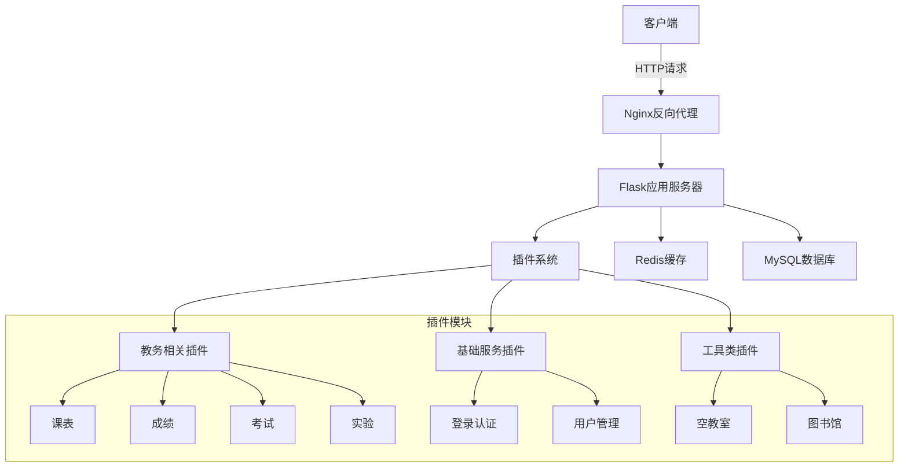
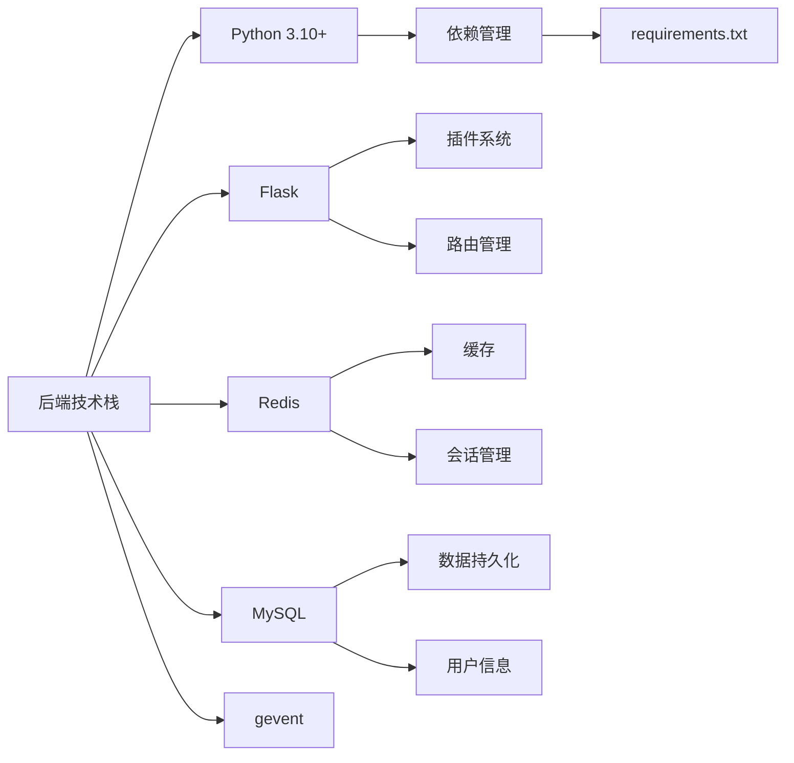

# Nuc-Go-Backend

## 项目概述
这是一个基于Flask的教务系统API服务，提供了课表导出、成绩查询等核心教务功能。项目采用Redis缓存和MySQL存储数据，使用插件化架构设计，支持功能的灵活扩展和维护。

## 系统架构



## 技术栈



## 目录结构

### 核心文件
- `index.py` - 项目入口文件
- `global_config.py` - 全局配置文件
- `requirements.txt` - 项目依赖
- `Dockerfile` - 容器构建文件

### 插件模块 (plugins_v3/)

- `basic/` - 基础功能插件（测试使用，没有业务功能）
- `_login/` - 登录认证插件
- `timetable/` - 课表相关功能
- `grade/` - 成绩查询功能
- `experiment/` - 实验课程功能
- `exam/` - 考试信息功能
- `empty_classroom/` - 空教室查询
- `library/` - 图书馆相关功能
- `physical/` - 体育相关功能
- `notice/` - 通知公告功能
- `get_openid/` - 微信openid获取

### 工具类 (utils/)
- `sql_helper.py` - 数据库操作助手
- `spyder_course.py` - 课程爬虫工具
- `gol.py` - 全局变量管理
- `session.py` - 会话管理
- `exceptions.py` - 异常处理
- `redis_connections.py` - Redis连接管理
- `myrsa.py` - RSA加密工具
- `logger.py` - 日志管理
- `decorators/` - 装饰器集合

## 主要功能模块

### 1. 认证系统
- RSA加密的登录验证
- 会话管理
- 权限控制

### 2. 教务功能
- 课表查询与导出
- 成绩查询
- 考试信息查询
- 实验课程管理
- 空教室查询

### 3. 系统特性
- Redis缓存
- 异常处理机制
- 日志记录
- 插件化架构

## 部署说明

### Docker部署（推荐）
```bash
# 构建镜像
docker build -t nuc-go-backend .

# 运行容器
docker run -d \
  -p 5000:5000 \
  -v /path/to/config:/app/config \
  -v /path/to/logs:/app/logs \
  --name nuc-go-backend \
  nuc-go-backend
```

### 本地部署
1. 安装Python 3.10+
2. 安装依赖：`pip install -r requirements.txt`
3. 配置`global_config.py`
4. 运行：`python index.py`

## 配置说明

### 必要配置项
- 数据库连接信息
- Redis连接信息
- 加密密钥
- 日志级别

### 可选配置项
- 缓存时间
- 请求限制
- 调试模式

## 开发指南

### 添加新插件
1. 在`plugins_v3`目录下创建新目录
2. 实现插件接口
3. 注册路由
4. 添加配置项

### 代码规范
- 遵循PEP 8规范
- 添加中文注释
- 编写单元测试

## 注意事项
1. 确保配置文件的安全性
2. 定期备份数据库
3. 监控系统日志
4. 及时更新依赖包

## 维护说明
- 定期检查日志
- 监控系统性能
- 更新安全补丁
- 备份重要数据 